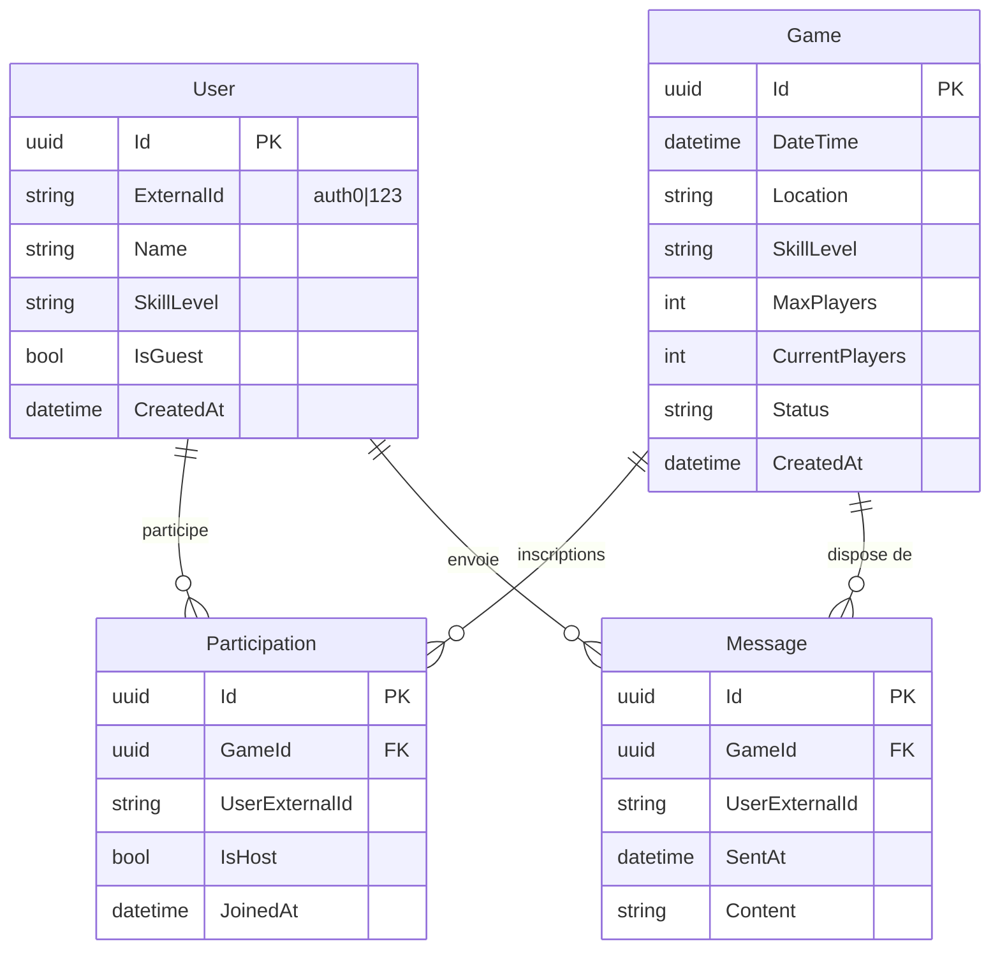

# Architecture Vibora MVP

## Vue d'Ensemble

Vibora utilise une **architecture monolithique modulaire** en .NET 9, combinant les principes de Domain-Driven Design (DDD), Clean Architecture et CQRS. Cette approche offre la simplicité d'un monolithe tout en permettant une évolution future vers des microservices.

### Principes Fondamentaux

1. **Modular Monolith** : Un seul déploiement découpé en modules faiblement couplés
2. **Clean Architecture** : Séparation stricte des responsabilités en couches
3. **CQRS avec MediatR** : Séparation Commands (écriture) / Queries (lecture)
4. **Domain-Driven Design** : Agrégats, Bounded Contexts, Domain Events

## État d'Implémentation (2025-10-05)

### ✅ Patterns Implémentés

- **Clean Architecture** : Séparation Api / Application / Domain / Infrastructure
- **CQRS** : Commands et Queries avec MediatR
- **Result Pattern** : Domain retourne `Result<T>` (pas d'exceptions fonctionnelles)
- **Unit of Work + Domain Events** : Transaction atomique avec publication d'events après commit
- **Strategy Pattern Monolith/Microservices** : Communication inter-modules via `IUsersServiceClient`
- **Repository Pattern** : Abstraction de la persistence
- **Migration Service Pattern** : Orchestration automatique des migrations EF Core avec Aspire

### ✅ Modules Opérationnels

- **Module Users** : Gestion utilisateurs (CRUD, Query `GetUserByExternalIdQuery`)
- **Module Games** : Création de parties avec validation Domain, auto-participation hôte
- **Module Shared** : `AggregateRoot`, `IUnitOfWork`, `IDomainEvent`, `Result<T>`
- **Vibora.MigrationService** : Worker dédié orchestrant les migrations EF Core au démarrage

### 🔧 Stack Technique

- **.NET 9** avec Aspire pour la configuration
- **EF Core** : `GamesDbContext`, `UsersDbContext` (même base PostgreSQL, tables séparées)
- **MediatR** : Implémentation CQRS
- **MassTransit** : Configuré InMemory (prêt pour RabbitMQ)
- **Ardalis.Result** : Gestion d'erreurs fonctionnelle
- **Tests** : xUnit + FluentAssertions + TestContainers + WebApplicationFactory

## Structure d'un Module (Clean Architecture)

Chaque module suit cette structure stricte avec encapsulation complète :

```
Vibora.Games/
├── Api/                               # Présentation
│   └── GameEndpoints.cs               # Minimal API (aucune logique métier)
├── Application/                       # Orchestration
│   ├── Commands/
│   │   └── CreateGame/
│   │       ├── CreateGameCommand.cs
│   │       └── CreateGameCommandHandler.cs
│   ├── Queries/
│   └── EventHandlers/
│       └── GameCreatedDomainEventHandler.cs
├── Domain/                            # Logique métier
│   ├── Game.cs                        # Agrégat racine (hérite AggregateRoot)
│   ├── Participation.cs               # Entité
│   ├── IGameRepository.cs             # Abstraction persistence
│   └── Events/
│       └── GameCreatedDomainEvent.cs
├── Infrastructure/                    # Détails techniques
│   ├── Data/
│   │   └── GamesDbContext.cs
│   ├── Persistence/
│   │   └── GameRepository.cs
│   └── Services/
│       ├── IUsersServiceClient.cs     # Abstraction cross-module
│       ├── UsersServiceInProcessClient.cs
│       └── UsersServiceHttpClient.cs
└── GamesModuleServiceRegistrar.cs     # SEULE classe publique
```

### Règles de Dépendance

```
┌──────────────────────────────────┐
│       Api (Endpoints)            │  ─┐
│  ┌───────────────────────────┐   │   │
│  │      Application          │   │   │ Dépendances
│  │  ┌─────────────────────┐  │   │   │ vers l'intérieur
│  │  │      Domain         │  │   │   │ uniquement
│  │  │  (Entities, Rules)  │  │   │   │
│  │  └─────────────────────┘  │   │   │
│  │    Infrastructure         │   │   │
│  └───────────────────────────┘   │   │
└──────────────────────────────────┘  ─┘
```

**Interdictions** :
- ❌ **Api** ne peut PAS appeler **Domain** directement
- ❌ **Domain** ne peut PAS dépendre de **Infrastructure**
- ✅ **Application** orchestre **Domain** + **Infrastructure**
- ✅ **Api** utilise uniquement **Application** (via MediatR)

### Pattern Ardalis : Encapsulation Stricte

Un seul point d'entrée public par module :

```csharp
// GamesModuleServiceRegistrar.cs - SEULE classe publique
public static class GamesModuleServiceRegistrar
{
    public static IServiceCollection AddGamesModule(
        this IServiceCollection services,
        IHostApplicationBuilder builder)
    {
        builder.AddNpgsqlDbContext<GamesDbContext>("viboradb");
        services.AddScoped<IGameRepository, GameRepository>();
        services.AddScoped<IUnitOfWork, UnitOfWork<GamesDbContext>>();
        
        services.AddMediatR(cfg =>
        {
            cfg.RegisterServicesFromAssembly(typeof(GamesModuleServiceRegistrar).Assembly);
        });
        
        return services;
    }
    
    public static IEndpointRouteBuilder MapGamesEndpoints(
        this IEndpointRouteBuilder endpoints)
    {
        endpoints.MapGameEndpoints();
        return endpoints;
    }
}
```

**Tout le reste est `internal`** : Domain, Infrastructure, Application, Api.

## Domaines et Agrégats (DDD)

### Module Users

**Agrégat** : `User`

**Responsabilités** :
- Gestion des comptes joueurs et profils
- Synchronisation métadonnées depuis Auth0/Supabase
- Mode invité (utilisateurs temporaires)

**Entités** :
```csharp
internal sealed class User : AggregateRoot
{
    public Guid Id { get; }
    public string ExternalId { get; }  // "auth0|123"
    public string Name { get; }
    public string SkillLevel { get; }
    public bool IsGuest { get; }
    public DateTime CreatedAt { get; }
}
```

### Module Games

**Agrégat** : `Game`

**Responsabilités** :
- Création et gestion de parties
- Matchmaking (recherche de parties disponibles)
- Gestion des inscriptions

**Entités** :
```csharp
internal sealed class Game : AggregateRoot
{
    public Guid Id { get; }
    public DateTime DateTime { get; }
    public string Location { get; }
    public string SkillLevel { get; }
    public int MaxPlayers { get; }
    public int CurrentPlayers { get; private set; }
    public GameStatus Status { get; private set; }
    private readonly List<Participation> _participations;
    
    // Domain methods return Result
    public static Result<Game> Create(...) { }
    public Result AddParticipant(...) { }
    public Result RemoveParticipant(...) { }
    public Result Cancel() { }
}

internal sealed class Participation
{
    public Guid Id { get; }
    public Guid GameId { get; }
    public string UserExternalId { get; }
    public bool IsHost { get; }
    public DateTime JoinedAt { get; }
}
```

### Module Communication (Futur)

**Agrégat** : `Conversation`

**Responsabilités** :
- Chat de groupe par partie
- Messages éphémères (fermeture auto X heures après match)

## Modèle de Données

### Base de Données Relationnelle (PostgreSQL)

Une seule base de données partagée avec DbContexts séparés par module :



## CQRS avec MediatR

### Commands (Écriture)

```csharp
// Command
internal sealed record CreateGameCommand(
    string HostExternalId,
    DateTime DateTime,
    string Location,
    string SkillLevel,
    int MaxPlayers,
    string? Notes
) : IRequest<Result<CreateGameResult>>;

// Handler
internal sealed class CreateGameCommandHandler
    : IRequestHandler<CreateGameCommand, Result<CreateGameResult>>
{
    private readonly IGameRepository _gameRepository;
    private readonly IUnitOfWork _unitOfWork;
    private readonly IUsersServiceClient _usersClient;
    
    public async Task<Result<CreateGameResult>> Handle(
        CreateGameCommand request,
        CancellationToken cancellationToken)
    {
        // 1. Query infrastructure (cross-module)
        var hostMetadata = await _usersClient.GetUserMetadataAsync(
            request.HostExternalId, cancellationToken);
        
        if (hostMetadata == null)
            return Result.Invalid(new ValidationError("Host not found"));
        
        // 2. Domain logic (validation + création)
        var createResult = Game.Create(
            request.HostExternalId,
            hostMetadata.Name,
            hostMetadata.SkillLevel,
            request.DateTime,
            request.Location,
            request.SkillLevel,
            request.MaxPlayers,
            request.Notes);
        
        if (!createResult.IsSuccess)
            return Result.Invalid(createResult.ValidationErrors);
        
        // 3. Persistence via Repository
        var game = createResult.Value;
        await _gameRepository.AddAsync(game, cancellationToken);
        await _unitOfWork.SaveChangesAsync(cancellationToken); // Transaction + Events
        
        // 4. Return DTO
        return Result.Success(MapToResult(game));
    }
}
```

### Queries (Lecture)

```csharp
internal sealed record GetUserByExternalIdQuery(string ExternalId)
    : IRequest<Result<UserMetadataResult>>;

internal sealed class GetUserByExternalIdQueryHandler
    : IRequestHandler<GetUserByExternalIdQuery, Result<UserMetadataResult>>
{
    private readonly UsersDbContext _dbContext;
    
    public async Task<Result<UserMetadataResult>> Handle(...)
    {
        var user = await _dbContext.Users
            .FirstOrDefaultAsync(u => u.ExternalId == request.ExternalId);
        
        if (user == null)
            return Result.NotFound("User not found");
        
        return Result.Success(new UserMetadataResult(
            user.ExternalId, user.Name, user.SkillLevel));
    }
}
```

### Endpoints API

```csharp
internal static class GameEndpoints
{
    public static IEndpointRouteBuilder MapGameEndpoints(
        this IEndpointRouteBuilder endpoints)
    {
        var gamesGroup = endpoints.MapGroup("/games").WithTags("Games");
        
        gamesGroup.MapPost("/", CreateGame)
            .WithName("CreateGame")
            .Produces<CreateGameResult>(StatusCodes.Status201Created);
        
        return endpoints;
    }
    
    // Endpoint délègue TOUT à MediatR
    private static async Task<IResult> CreateGame(
        CreateGameRequest request,
        HttpContext httpContext,
        ISender sender)
    {
        var externalId = httpContext.User.FindFirst("sub")?.Value;
        if (string.IsNullOrEmpty(externalId))
            return Results.Unauthorized();
        
        var command = new CreateGameCommand(
            externalId, request.DateTime, request.Location,
            request.SkillLevel, request.MaxPlayers, request.Notes);
        
        var result = await sender.Send(command);
        return result.ToMinimalApiResult(); // Ardalis.Result.AspNetCore
    }
}
```

## Patterns Clés Implémentés

### 1. Result Pattern (pas d'exceptions fonctionnelles)

```csharp
// Domain retourne Result
public static Result<Game> Create(...)
{
    // Validation complète (toutes les erreurs collectées)
    var validationResult = Validate(dateTime, location, skillLevel, maxPlayers);
    if (!validationResult.IsSuccess)
        return Result<Game>.Invalid(validationResult.ValidationErrors);
    
    var game = new Game { ... };
    
    // Business logic
    var addResult = game.AddParticipant(...);
    if (!addResult.IsSuccess)
        return Result<Game>.Error(addResult.Errors);
    
    return Result<Game>.Success(game);
}
```

### 2. Unit of Work + Domain Events

```csharp
// Game.cs - Domain raise des events
public static Result<Game> Create(...)
{
    var game = new Game { ... };
    
    // Raise domain event (pas de publish!)
    game.AddDomainEvent(new GameCreatedDomainEvent(
        game.Id, game.HostExternalId, game.DateTime, ...));
    
    return Result<Game>.Success(game);
}

// UnitOfWork - Publie après transaction
public async Task<int> SaveChangesAsync(CancellationToken cancellationToken)
{
    // 1. Collect domain events
    var events = _dbContext.ChangeTracker
        .Entries<AggregateRoot>()
        .SelectMany(e => e.Entity.DomainEvents)
        .OrderBy(e => e.OccurredOn)
        .ToList();
    
    // 2. Save to DB (transaction)
    var result = await _dbContext.SaveChangesAsync(cancellationToken);
    
    // 3. Publish events AFTER successful save
    foreach (var domainEvent in events)
    {
        await PublishIntegrationEventAsync(domainEvent, cancellationToken);
    }
    
    // 4. Clear events
    foreach (var aggregate in aggregateRoots)
        aggregate.ClearDomainEvents();
    
    return result;
}
```

### 3. Strategy Pattern : Monolith ↔ Microservices

Communication inter-modules via abstraction :

```csharp
// Interface commune
public interface IUsersServiceClient
{
    Task<UserMetadataDto?> GetUserMetadataAsync(string externalId);
}

// Implémentation 1: In-Process (Monolith)
public class UsersServiceInProcessClient : IUsersServiceClient
{
    private readonly ISender _sender; // MediatR
    
    public async Task<UserMetadataDto?> GetUserMetadataAsync(string externalId)
    {
        // Direct MediatR call (même processus)
        var query = new GetUserByExternalIdQuery(externalId);
        var result = await _sender.Send(query);
        return result.IsSuccess ? MapToDto(result.Value) : null;
    }
}

// Implémentation 2: HTTP (Microservices)
public class UsersServiceHttpClient : IUsersServiceClient
{
    private readonly HttpClient _httpClient;
    
    public async Task<UserMetadataDto?> GetUserMetadataAsync(string externalId)
    {
        // HTTP call to separate Users service
        var response = await _httpClient.GetAsync($"/users/{externalId}");
        return response.IsSuccessStatusCode
            ? await response.Content.ReadFromJsonAsync<UserMetadataDto>()
            : null;
    }
}

// Configuration (Program.cs)
if (deploymentMode == "Monolith")
{
    services.AddScoped<IUsersServiceClient, UsersServiceInProcessClient>();
}
else if (deploymentMode == "Microservices")
{
    services.AddHttpClient<IUsersServiceClient, UsersServiceHttpClient>(client =>
    {
        client.BaseAddress = new Uri(usersServiceUrl);
    });
}
```

Configuration via `appsettings.json` :
```json
{
  "DeploymentMode": "Monolith"  // ou "Microservices"
}
```

## Communication Inter-Modules (MassTransit)

### Pattern Outbox (Résilience)

Garantit l'atomicité DB + publication d'événements :

```csharp
// Configuration
builder.AddNpgsqlDbContext<GamesDbContext>("viboradb");

services.AddMassTransit(x =>
{
    x.AddEntityFrameworkOutbox<GamesDbContext>(cfg =>
    {
        cfg.UsePostgres();
        cfg.UseBusOutbox();
    });
    
    x.UsingInMemory((context, cfg) =>
    {
        cfg.ConfigureEndpoints(context);
    });
});
```

### Événements d'Intégration

```csharp
// Vibora.Games.Contracts/Events/GameCreatedEvent.cs
public record GameCreatedEvent
{
    public Guid GameId { get; init; }
    public string HostExternalId { get; init; }
    public DateTime DateTime { get; init; }
    public string Location { get; init; }
    public DateTime CreatedAt { get; init; }
}

// Consumer (Module Communication)
public class GameCreatedConsumer : IConsumer<GameCreatedEvent>
{
    public async Task Consume(ConsumeContext<GameCreatedEvent> context)
    {
        // Créer automatiquement un chat pour la partie
        var chatRoom = new ChatRoom(context.Message.GameId);
        await _dbContext.ChatRooms.AddAsync(chatRoom);
        await _dbContext.SaveChangesAsync();
    }
}
```

## Migrations EF Core avec .NET Aspire

### Pattern Migration Service (Worker)

Les migrations EF Core sont orchestrées via un **Worker Service dédié** qui s'exécute automatiquement au démarrage avant l'API Web.

```
Solution/
├── Vibora.AppHost/              # Orchestrateur Aspire
├── Vibora.MigrationService/     # Worker de migrations
│   ├── Worker.cs                # Applique migrations pour tous les DbContexts
│   └── Program.cs               # Configuration des DbContexts
├── Vibora.Web/                  # API (démarre après migrations)
└── modules/
    ├── Games/
    │   └── Infrastructure/Data/
    │       ├── GamesDbContext.cs
    │       └── Migrations/       # Migrations générées par EF Core
    └── Users/
        └── Infrastructure/Data/
            ├── UsersDbContext.cs
            └── Migrations/
```

### Orchestration Aspire

```csharp
// Vibora.AppHost/AppHost.cs
var postgres = builder.AddPostgres("postgres")
    .WithPgAdmin();

var viboraDb = postgres.AddDatabase("viboradb");

// 1. Migration service s'exécute en premier
var migrations = builder.AddProject<Projects.Vibora_MigrationService>("vibora-migrations")
    .WithReference(viboraDb)
    .WaitFor(viboraDb);

// 2. API Web démarre UNIQUEMENT après les migrations
var apiService = builder.AddProject<Projects.Vibora_Web>("vibora-web")
    .WithReference(viboraDb)
    .WithReference(migrations)
    .WaitForCompletion(migrations); // ⭐ Attend la fin des migrations
```

### Worker de Migration

```csharp
// Vibora.MigrationService/Worker.cs
protected override async Task ExecuteAsync(CancellationToken stoppingToken)
{
    try
    {
        await using var scope = _serviceProvider.CreateAsyncScope();
        
        var gamesDbContext = scope.ServiceProvider.GetRequiredService<GamesDbContext>();
        var usersDbContext = scope.ServiceProvider.GetRequiredService<UsersDbContext>();

        // Applique migrations pour chaque module
        await ApplyMigrationsAsync(gamesDbContext, "GamesDbContext", stoppingToken);
        await ApplyMigrationsAsync(usersDbContext, "UsersDbContext", stoppingToken);

        _logger.LogInformation("All migrations completed successfully");
    }
    finally
    {
        _hostApplicationLifetime.StopApplication(); // S'arrête après les migrations
    }
}

private async Task ApplyMigrationsAsync(DbContext dbContext, string contextName, CancellationToken cancellationToken)
{
    var strategy = dbContext.Database.CreateExecutionStrategy(); // Résilience
    
    await strategy.ExecuteAsync(async () =>
    {
        var pendingMigrations = await dbContext.Database.GetPendingMigrationsAsync(cancellationToken);
        
        if (pendingMigrations.Any())
        {
            _logger.LogInformation("Applying {Count} pending migrations for {ContextName}", 
                pendingMigrations.Count(), contextName);
            await dbContext.Database.MigrateAsync(cancellationToken);
        }
    });
}
```

### Cycle de Démarrage

```
1. PostgreSQL démarre
   ↓
2. vibora-migrations s'exécute
   - Vérifie migrations en attente
   - Applique migrations automatiquement
   - S'arrête proprement
   ↓
3. vibora-web démarre
   - Base de données à jour garantie
```

### Avantages

✅ **Migrations automatiques** au démarrage  
✅ **Ordre d'exécution garanti** (DB → Migrations → API)  
✅ **Résilience** via execution strategies  
✅ **Logs détaillés** dans le Dashboard Aspire  
✅ **Extensible** : ajouter un nouveau DbContext = 2 lignes de code  

### Créer une nouvelle migration

```bash
# Pour GamesDbContext
dotnet ef migrations add MigrationName \
  --project src/modules/Games/Vibora.Games/Vibora.Games.csproj \
  --startup-project src/Vibora.MigrationService/Vibora.MigrationService.csproj \
  --context GamesDbContext \
  --output-dir Infrastructure/Data/Migrations

# Pour UsersDbContext
dotnet ef migrations add MigrationName \
  --project src/modules/Users/Vibora.Users/Vibora.Users.csproj \
  --startup-project src/Vibora.MigrationService/Vibora.MigrationService.csproj \
  --context UsersDbContext \
  --output-dir Infrastructure/Data/Migrations
```

## Authentification (Auth0/Supabase)

### Principes

1. **JWT émis par provider externe** (Auth0, Supabase)
2. **Module Users stocke uniquement métadonnées** locales
3. **UserID = ExternalId du JWT** (sub claim)

### Flux

```
1. User login via Auth0/Supabase
   ↓
2. Client reçoit JWT avec sub="auth0|123"
   ↓
3. Client appelle POST /users/sync avec JWT
   ↓
4. Backend valide JWT et extrait sub
   ↓
5. Module Users crée/MAJ métadonnées locales
   ↓
6. Client peut appeler autres endpoints avec JWT
```

### Avantages

✅ Pas de gestion passwords  
✅ Pas de stockage email sensible  
✅ Performances (métadonnées en cache)  
✅ Sécurité (MFA géré par Auth0)  

## Tests

### Architecture

```
tests/
├── Vibora.Integration.Tests/          # Tests end-to-end (78 tests)
│   ├── Infrastructure/
│   │   ├── ViboraWebApplicationFactory.cs      # TestContainers PostgreSQL
│   │   ├── IntegrationTestBaseImproved.cs      # Base avec TestDataSeeder
│   │   ├── EventIntegrationTestBase.cs         # Base pour tests MassTransit
│   │   ├── TestDataSeeder.cs                   # Seeding centralisé
│   │   └── TestDataBuilders/
│   │       ├── GameBuilder.cs                  # Fluent API pour Game
│   │       └── UserBuilder.cs                  # Fluent API pour User
│   ├── Games/                                  # 68 tests
│   ├── Users/                                  # 6 tests
│   └── Notifications/                          # 4 tests
└── Vibora.*.Tests/                             # Tests unitaires par module
    ├── Domain/
    └── Application/
```

### Tests d'Intégration (Standards)

```csharp
public class CreateGameIntegrationTests : IntegrationTestBaseImproved
{
    [Fact]
    public async Task CreateGame_WithValidData_ShouldReturnCreatedGame()
    {
        // Arrange - Seed avec builder (1 ligne)
        var host = await Seeder.SeedUserAsync(u => u
            .WithExternalId("auth0|123")
            .WithName("Host")
            .Intermediate());

        var request = new { ... };

        AuthenticateAs(host.ExternalId);

        // Act
        var response = await Client.PostAsJsonAsync("/games", request);

        // Assert
        var game = await response.ReadAsAsync<GameDto>();
        game.CurrentPlayers.Should().Be(1);
    }
}
```

### Tests d'Événements (MassTransit)

```csharp
public class GameEventTests : EventIntegrationTestBase
{
    [Fact]
    public async Task CancelGame_ShouldPublishEvent()
    {
        // Arrange
        var (host, game) = await Seeder.SeedGameWithHostAsync();
        AuthenticateAs(host.ExternalId);

        // Act
        await Client.PostAsync($"/games/{game.Id}/cancel", null);

        // Assert - Polling avec timeout (pas de Task.Delay)
        var received = await WaitForEventAsync<GameCanceledEvent>(
            msg => msg.Context.Message.GameId == game.Id,
            timeout: TimeSpan.FromSeconds(5));

        received.Should().BeTrue();
    }
}
```

### Patterns de Test

- **Builders fluents** : `GameBuilder`, `UserBuilder` pour données de test cohérentes
- **TestDataSeeder** : Seeding centralisé (1 seul endroit à modifier)
- **Polling robuste** : `WaitForEventAsync()` au lieu de `Task.Delay()` (0 tests flaky)
- **34% moins de code** : 2,200 lignes vs 3,300 avant refactoring

## Références

- [Clean Architecture - Jason Taylor](https://www.youtube.com/watch?v=dK4Yb6-LxAk)
- [CQRS with MediatR - CodeOpinion](https://codeopinion.com/thin-controllers-cqrs-mediatr/)
- [Modular Monolith - Ardalis](https://ardalis.com/introducing-modular-monoliths-goldilocks-architecture/)
- [DDD - Eric Evans](https://www.domainlanguage.com/ddd/)
- [MassTransit Outbox](https://masstransit.io/documentation/configuration/middleware/outbox)
- [Result Pattern - Vladimir Khorikov](https://enterprisecraftsmanship.com/posts/error-handling-exception-or-result/)
- [EF Core Migrations in Aspire - Microsoft Docs](https://learn.microsoft.com/en-us/dotnet/aspire/database/ef-core-migrations)
